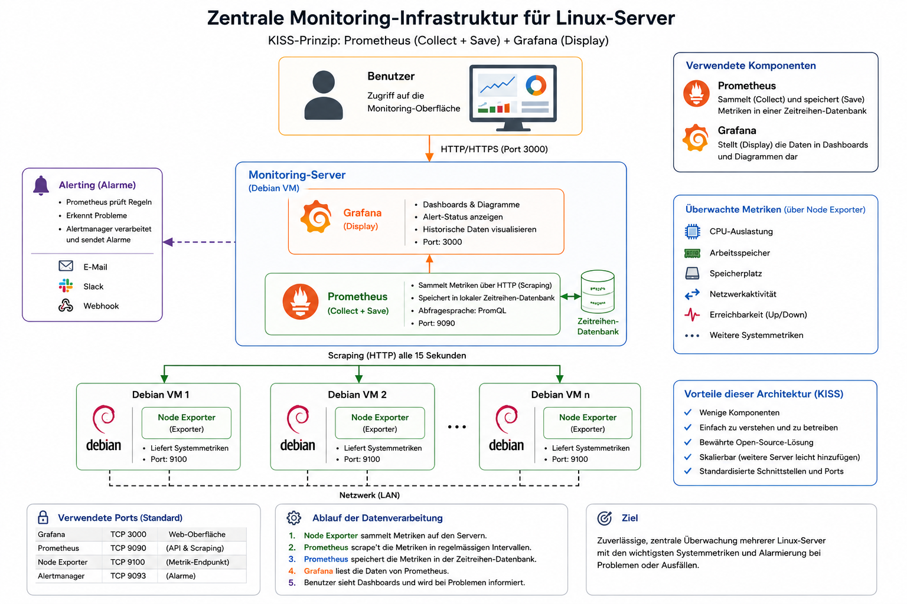

# Zentrale Monitoring Infrastruktur für Linux-Server
Projekt 3 für das Fach Netzwerkbetriebssysteme

## Projektbeschreibung

Im Rahmen dieses Projekts werde ich eine zentrale Monitoring-Infrastruktur für mehrere Linux-Server aufbauen.

Ziel ist es, den Zustand mehrerer Debian-Server zentral zu überwachen. Systemdaten werden automatisch gesammelt, gespeichert und über eine grafische Oberfläche dargestellt.

Das Projekt besteht aus drei grundlegenden Bereichen:

- **Collect:** Systemdaten erfassen
- **Save:** Messwerte zentral speichern
- **Display:** Messwerte übersichtlich darstellen

Für die Umsetzung werden **Prometheus**, **Grafana** und **Node Exporter** eingesetzt.

---

## Was werde ich machen?

Ich werde mehrere Debian-Server zentral überwachen.

Auf den zu überwachenden Servern stellt **Node Exporter** die benötigten Systemmetriken bereit. **Prometheus** sammelt und speichert diese Messwerte zentral. **Grafana** greift auf die Daten von Prometheus zu und stellt sie in einem Dashboard dar.

Folgende Informationen werden überwacht:

- CPU-Auslastung
- Arbeitsspeicher
- Speicherplatz
- Netzwerkaktivität
- Erreichbarkeit der Server

Neben den aktuellen Messwerten sollen auch historische Daten betrachtet werden können.

Zusätzlich sollen Probleme und Ausfälle eines Servers anhand der gesammelten Daten erkannt werden können.

---

## Wie werde ich es machen?

Die Umgebung wird mit mehreren Debian-VMs aufgebaut.

Eine Debian-VM dient als zentraler Monitoring-Server. Auf diesem werden **Prometheus** und **Grafana** betrieben.

Die weiteren Debian-VMs stellen die zu überwachenden Systeme dar. Auf diesen wird **Node Exporter** eingesetzt, um die benötigten Systemmetriken bereitzustellen.

Prometheus fragt diese Messwerte regelmässig ab und speichert sie zentral. Grafana verwendet Prometheus als Datenquelle und stellt die gesammelten Informationen grafisch dar.

Anschliessend werde ich gezielt verschiedene Zustände auf den überwachten Servern erzeugen. Damit wird geprüft, ob Veränderungen und Ausfälle durch das Monitoring erkannt und dargestellt werden.

---

## Architektur

Die Architektur besteht aus drei wesentlichen Komponenten:

- **Node Exporter** stellt die Systemmetriken der einzelnen Debian-Server bereit.
- **Prometheus** sammelt diese Metriken regelmässig und speichert sie.
- **Grafana** greift auf die Daten von Prometheus zu und stellt diese in Dashboards und Diagrammen dar.

Der Datenfluss sieht vereinfacht folgendermassen aus:

`Debian Server → Node Exporter → Prometheus → Grafana → Benutzer`

---

## Messbare Ziele

Das Projekt gilt als erfolgreich, wenn folgende Anforderungen erfüllt sind:

- Mindestens zwei Debian-Server werden überwacht.
- CPU-Auslastung wird erfasst und dargestellt.
- Arbeitsspeicher wird erfasst und dargestellt.
- Speicherplatz wird erfasst und dargestellt.
- Netzwerkaktivität wird erfasst und dargestellt.
- Die Erreichbarkeit der Server wird überwacht.
- Prometheus speichert die Messwerte zentral.
- Grafana stellt die Messwerte in einem Dashboard dar.
- Historische Messwerte können betrachtet werden.
- Ausfälle und auffällige Systemzustände können erkannt werden.

---

## Tests und Verifikation

Die Anforderungen werden mit gezielten Tests überprüft.

### CPU

Auf einem überwachten Server wird die CPU gezielt belastet.

Die erhöhte CPU-Auslastung muss im Grafana-Dashboard sichtbar sein.

### Arbeitsspeicher

Die Nutzung des Arbeitsspeichers wird erhöht.

Die Veränderung muss durch Prometheus erfasst und in Grafana dargestellt werden.

### Speicherplatz

Auf einem überwachten Server wird zusätzlicher Speicherplatz belegt.

Die Veränderung des verfügbaren Speicherplatzes muss im Dashboard sichtbar sein.

### Netzwerk

Auf einem überwachten Server wird Netzwerkverkehr erzeugt.

Die erhöhte Netzwerkaktivität muss anhand der Messwerte erkennbar sein.

### Erreichbarkeit

Ein überwachter Server wird ausgeschaltet oder vom Netzwerk getrennt.

Das Monitoring muss erkennen, dass der Server nicht mehr erreichbar ist. Nach dem Start des Servers muss dieser wieder als erreichbar erkannt werden.

### Historische Daten

Nach den Tests wird überprüft, ob die zuvor erzeugten Veränderungen weiterhin in den historischen Messwerten sichtbar sind.

Damit wird geprüft, ob Prometheus die Daten nicht nur erfasst, sondern auch über einen Zeitraum speichert.

---

## Erwartetes Ergebnis

Am Ende des Projekts soll eine funktionierende zentrale Monitoring-Infrastruktur vorhanden sein.

Prometheus übernimmt das **Sammeln und Speichern** der Messwerte. Grafana übernimmt die **Darstellung** der Daten.

Der Zustand aller überwachten Debian-Server soll dadurch an einem zentralen Ort betrachtet werden können.

Veränderungen und Ausfälle der überwachten Systeme sollen anhand der gesammelten Messwerte erkannt und nachvollzogen werden können.
