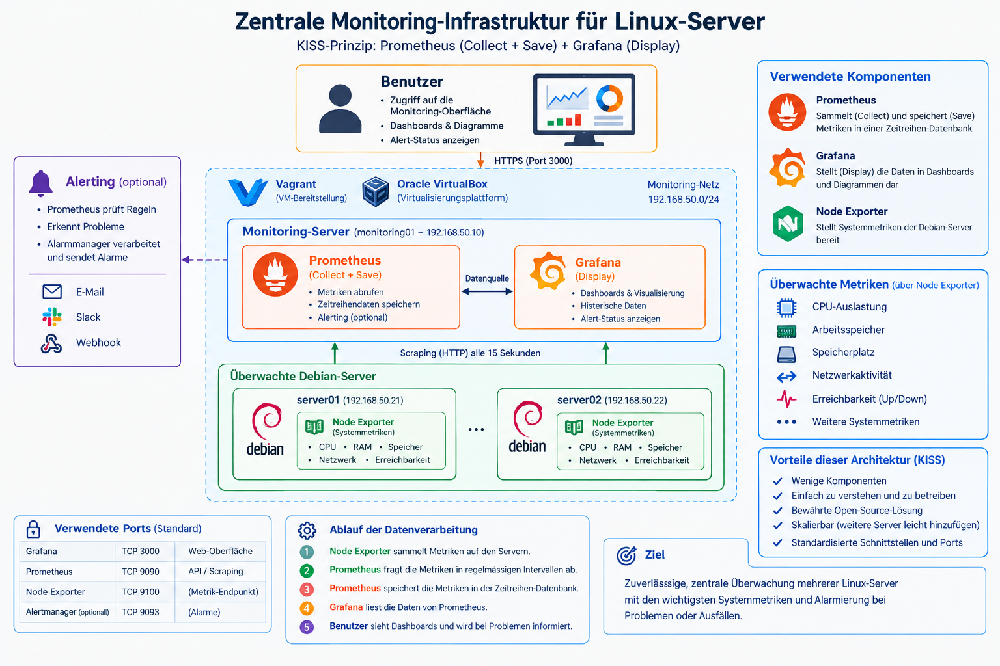

# Projektspezifikation
## Zentrale Monitoring-Infrastruktur für Linux-Server

| Information | Wert |
|---|---|
| Modul | Netzwerkbetriebssysteme |
| Projekt | Zentrale Monitoring-Infrastruktur für Linux-Server |
| Betriebssystem | Debian Linux |
| Virtualisierung | Oracle VirtualBox |
| VM-Bereitstellung | Vagrant |
| Monitoring | Prometheus |
| Visualisierung | Grafana |
| Metriken | Node Exporter |

---

## 1. Idee und Lernziel

Beim Betrieb mehrerer Linux-Server ist es wichtig, deren Zustand zentral
überwachen zu können. Ohne ein zentrales Monitoring müssen die Systeme
einzeln kontrolliert werden und Probleme oder Ausfälle werden möglicherweise
erst spät erkannt.

In diesem Projekt wird deshalb eine zentrale Monitoring-Infrastruktur für
mehrere Debian-Server aufgebaut.

Dabei soll erarbeitet werden, wie Systemmetriken von mehreren Linux-Servern
automatisch erfasst, zentral gespeichert und übersichtlich dargestellt
werden können.

Das Projekt besteht aus drei grundlegenden Bereichen:

- **Collect** – Systemdaten erfassen
- **Save** – Messwerte zentral speichern
- **Display** – Messwerte grafisch darstellen

Für die Umsetzung werden folgende Komponenten eingesetzt:

- **Node Exporter** zur Bereitstellung der Systemmetriken
- **Prometheus** zum Sammeln und Speichern der Metriken
- **Grafana** zur grafischen Darstellung der Metriken
- **Vagrant** zur Bereitstellung der virtuellen Maschinen
- **Oracle VirtualBox** als Virtualisierungsplattform

Ziel ist eine einfache und nachvollziehbare Monitoring-Umgebung, welche
reproduzierbar aufgebaut und mit definierten Tests überprüft werden kann.

---

## 2. Projektziel

Ziel des Projekts ist der Aufbau einer zentralen Monitoring-Infrastruktur
für mehrere Debian-Server.

Die Umgebung besteht aus:

- einem zentralen Monitoring-Server `monitoring01`
- einem überwachten Debian-Server `server01`
- einem überwachten Debian-Server `server02`

Die drei Systeme werden als virtuelle Maschinen mit Vagrant definiert und
auf Oracle VirtualBox betrieben.

Auf `server01` und `server02` wird Node Exporter eingesetzt. Dieser stellt
die Systemmetriken der beiden Server über das Netzwerk bereit.

Auf `monitoring01` werden Prometheus und Grafana betrieben.

Prometheus fragt die Metriken der beiden Node Exporter regelmässig ab und
speichert diese als Zeitreihendaten.

Grafana verwendet Prometheus als Datenquelle und stellt die gesammelten
Messwerte in einem zentralen Dashboard dar.

Mindestens folgende Informationen werden überwacht:

- CPU-Auslastung
- Arbeitsspeicher
- Speicherplatz
- Netzwerkaktivität
- Erreichbarkeit der Systeme

Neben den aktuellen Messwerten müssen auch historische Messwerte betrachtet
werden können.

---

## 3. Architektur

### 3.1 Systeme

Die Testumgebung besteht aus drei Debian-VMs.

| System | Hostname | Geplante IP-Adresse | Funktion | Komponenten |
|---|---|---|---|---|
| Monitoring-Server | `monitoring01` | `192.168.50.10` | Zentrales Monitoring | Prometheus, Grafana |
| Debian Server 1 | `server01` | `192.168.50.21` | Überwachtes System | Node Exporter |
| Debian Server 2 | `server02` | `192.168.50.22` | Überwachtes System | Node Exporter |

**Monitoring-Netz:** `192.168.50.0/24`

Die angegebenen IP-Adressen stellen die geplante Konfiguration dar.
Falls bei der Umsetzung Änderungen notwendig sind, werden die tatsächlich
verwendeten IP-Adressen in der Projektdokumentation ergänzt.

In den nachfolgenden Tests werden Platzhalter wie `<IP-server01>` verwendet.
Damit ist jeweils die tatsächlich konfigurierte IP-Adresse des entsprechenden
Systems gemeint.

---

### 3.2 Virtualisierung

Als Virtualisierungsplattform wird **Oracle VirtualBox** verwendet.

Die virtuellen Maschinen werden mit **Vagrant** definiert und bereitgestellt.

Das Vagrantfile definiert mindestens:

- Anzahl der virtuellen Maschinen
- Hostnamen
- Debian als Betriebssystem
- Netzwerkparameter
- IP-Adressen

Dadurch soll die Testumgebung reproduzierbar erstellt werden können.

Die grundlegende Bereitstellung erfolgt nach folgendem Prinzip:

`Vagrant → Oracle VirtualBox → Debian VMs → Monitoring`

---

### 3.3 Monitoring

Auf `server01` und `server02` wird Node Exporter betrieben.

Node Exporter stellt die Systemmetriken über TCP-Port `9100` bereit.

Prometheus wird auf `monitoring01` betrieben und fragt die Node-Exporter-
Endpunkte regelmässig über HTTP ab.

Prometheus übernimmt innerhalb des Projekts:

- **Collect** – Metriken von den Servern abrufen
- **Save** – Metriken als Zeitreihendaten speichern

Grafana wird ebenfalls auf `monitoring01` betrieben.

Grafana verwendet Prometheus als Datenquelle und übernimmt:

- **Display** – Messwerte in Dashboards und Diagrammen darstellen

Der grundlegende Datenfluss lautet:

`Debian Server → Node Exporter → Prometheus → Grafana → Benutzer`

---

### 3.4 Architekturdiagramm

---

### 3.5 Verwendete Dienste und Ports

| Komponente | System | Port / Protokoll | Verwendung |
|---|---|---|---|
| Grafana | `monitoring01` | TCP 3000 | Weboberfläche |
| Prometheus | `monitoring01` | TCP 9090 | Weboberfläche und API |
| Node Exporter | `server01` | TCP 9100 | Bereitstellung der Systemmetriken |
| Node Exporter | `server02` | TCP 9100 | Bereitstellung der Systemmetriken |
| ICMP | Alle Systeme | ICMP | Prüfung der Erreichbarkeit |

---

## 4. Funktionsweise

### 4.1 Node Exporter

Node Exporter läuft auf den zu überwachenden Debian-Servern `server01`
und `server02`.

Der Dienst stellt die Systemmetriken des jeweiligen Servers über den
HTTP-Endpunkt `/metrics` auf TCP-Port `9100` bereit.

Node Exporter liefert unter anderem Informationen über:

- CPU
- Arbeitsspeicher
- Dateisystem
- Netzwerk
- Systemzustand

---

### 4.2 Prometheus

Prometheus läuft auf `monitoring01`.

Die Node Exporter von `server01` und `server02` werden in Prometheus als
Targets definiert.

Prometheus fragt die Metriken regelmässig über HTTP ab und speichert sie
als Zeitreihendaten.

Die Erreichbarkeit eines konfigurierten Targets kann in Prometheus über
die Metrik beziehungsweise PromQL-Abfrage `up` kontrolliert werden.

Ein Wert von:

- `1` bedeutet, dass das Target erfolgreich abgefragt werden konnte.
- `0` bedeutet, dass das Target nicht erfolgreich abgefragt werden konnte.

---

### 4.3 Grafana

Grafana läuft auf `monitoring01` und verwendet Prometheus als Datenquelle.

Über die Grafana-Weboberfläche werden die wichtigsten Messwerte von
`server01` und `server02` in einem zentralen Dashboard dargestellt.

Das Dashboard zeigt mindestens:

- CPU-Auslastung
- Arbeitsspeicher
- Speicherplatz
- Netzwerkaktivität
- Erreichbarkeit

Zusätzlich müssen historische Messwerte betrachtet werden können.

---

## 5. Messbare Anforderungen und Verifikation

Die folgenden Anforderungen definieren die technischen Ziele des Projekts.

Zu jeder Anforderung wird beschrieben:

- was umgesetzt werden muss,
- wie die Umsetzung geprüft wird,
- welche Befehle beziehungsweise Prüfmethoden verwendet werden,
- wann die Anforderung als erfüllt gilt.

| ID | Anforderung | Umsetzung | Verifikation / Befehl | Erfolgskriterium |
|---|---|---|---|---|
| INF-01 | Virtuelle Maschinen bereitstellen | `monitoring01`, `server01` und `server02` werden mit Vagrant definiert und auf Oracle VirtualBox betrieben. | Status der VMs mit `vagrant status` kontrollieren. | Alle drei VMs werden als laufend angezeigt. |
| NET-01 | IP-Konfiguration | Alle drei Systeme erhalten eine statische IP-Adresse im privaten Monitoring-Netz. | Auf jeder VM die Netzwerkkonfiguration mit `ip addr` kontrollieren. | Jede VM besitzt die vorgesehene IP-Adresse im Monitoring-Netz. |
| NET-02 | Netzwerkverbindung | `monitoring01` muss beide überwachten Server über das Monitoring-Netz erreichen können. | Von `monitoring01`: `ping <IP-server01>` und `ping <IP-server02>`. | Beide Server beantworten die ICMP-Anfragen. |
| MON-01 | Node Exporter | Auf `server01` und `server02` wird Node Exporter als Dienst betrieben. | Auf beiden Servern `systemctl status node_exporter` prüfen. | Node Exporter läuft auf beiden Systemen. |
| MON-02 | Metrik-Endpunkt | Node Exporter stellt seine Metriken über TCP-Port `9100` und `/metrics` bereit. | Von `monitoring01`: `curl http://<IP-server01>:9100/metrics` und entsprechend für `server02`. | Beide Endpunkte sind erreichbar und liefern Metriken zurück. |
| MON-03 | Prometheus | Prometheus wird auf `monitoring01` betrieben und überwacht beide Node Exporter. | `systemctl status prometheus` sowie die konfigurierten Targets in Prometheus kontrollieren. | Prometheus läuft und beide Server sind als Targets vorhanden. |
| MON-04 | Prometheus Targets | Prometheus muss die Metriken von `server01` und `server02` erfolgreich abrufen können. | In Prometheus die PromQL-Abfrage `up` ausführen. | Beide Node-Exporter-Targets liefern den Wert `1`. |
| MON-05 | CPU-Monitoring | Die CPU-Metriken beider Server werden erfasst und in Grafana dargestellt. | Auf einem überwachten Server mit `stress --cpu <Anzahl-Worker>` CPU-Last erzeugen und Grafana beobachten. | Während des Tests steigt die dargestellte CPU-Auslastung deutlich an und sinkt danach wieder. |
| MON-06 | RAM-Monitoring | Die Arbeitsspeichernutzung beider Server wird erfasst und dargestellt. | Ausgangswert mit `free -h` kontrollieren und anschliessend mit `stress --vm <Anzahl-Worker> --vm-bytes <Speichermenge>` Arbeitsspeicher belasten. | Die erhöhte RAM-Nutzung ist auf dem Server und in Grafana sichtbar. |
| MON-07 | Speicher-Monitoring | Die Belegung der Dateisysteme wird durch Node Exporter erfasst. | Vor und nach dem Erstellen einer Testdatei die Speicherbelegung mit `df -h` vergleichen. | Die Veränderung der Speicherbelegung ist auch in Grafana sichtbar. |
| MON-08 | Netzwerk-Monitoring | Ein- und ausgehender Netzwerkverkehr wird erfasst. | Netzwerkschnittstellen mit `ip link` kontrollieren und anschliessend gezielt Netzwerkverkehr zwischen den Systemen erzeugen. | Während des Tests ist eine Veränderung der Netzwerkaktivität in Grafana sichtbar. |
| MON-09 | Ausfallerkennung | Prometheus muss erkennen, wenn Node Exporter auf einem überwachten Server nicht mehr erreichbar ist. | Zuerst PromQL `up` kontrollieren. Danach auf `server02` mit `systemctl stop node_exporter` den Dienst stoppen und `up` erneut prüfen. | Der Wert für `server02` wechselt nach dem nächsten Scrape von `1` auf `0`. |
| MON-10 | Wiederherstellung | Ein zuvor ausgefallenes Target muss nach der Wiederherstellung wieder automatisch erkannt werden. | Node Exporter auf `server02` mit `systemctl start node_exporter` starten und PromQL `up` erneut prüfen. | Der Wert für `server02` wechselt wieder von `0` auf `1`. |
| MON-11 | Grafana | Grafana wird auf `monitoring01` betrieben und verwendet Prometheus als Datenquelle. | `systemctl status grafana-server` kontrollieren und `http://<IP-monitoring01>:3000` im Browser öffnen. | Grafana ist erreichbar und Prometheus steht als Datenquelle zur Verfügung. |
| MON-12 | Dashboard | Ein zentrales Grafana-Dashboard stellt die Metriken beider Server dar. | Dashboard öffnen und die Messwerte von `server01` und `server02` kontrollieren. | CPU, RAM, Speicherplatz, Netzwerkaktivität und Erreichbarkeit beider Systeme werden dargestellt. |
| MON-13 | Historische Daten | Prometheus speichert die erfassten Metriken über einen Zeitraum. | Einen Belastungstest durchführen und danach in Grafana einen Zeitraum auswählen, der den Test enthält. | Die während des Tests erzeugten Veränderungen sind nach Beendigung weiterhin sichtbar. |

---

## 6. Test und Verifikation

Nach der Umsetzung werden die Anforderungen mit definierten Tests überprüft.

Die Tests werden aus Sicht eines System Engineers durchgeführt und müssen
reproduzierbare Ergebnisse liefern.

### Testübersicht

| Test-ID | Bezug | Test | Durchführung | Erwartetes Resultat |
|---|---|---|---|---|
| T01 | INF-01 | VM-Bereitstellung | Im Projektverzeichnis `vagrant status` ausführen. | `monitoring01`, `server01` und `server02` werden als laufend angezeigt. |
| T02 | NET-01 | IP-Konfiguration | Auf jeder VM `ip addr` ausführen und die konfigurierte Adresse kontrollieren. | Alle Systeme befinden sich im vorgesehenen Monitoring-Netz. |
| T03 | NET-02 | Erreichbarkeit `server01` | Von `monitoring01` `ping <IP-server01>` ausführen. | `server01` antwortet auf ICMP-Anfragen. |
| T04 | NET-02 | Erreichbarkeit `server02` | Von `monitoring01` `ping <IP-server02>` ausführen. | `server02` antwortet auf ICMP-Anfragen. |
| T05 | MON-01 | Node Exporter Dienst | Auf `server01` und `server02` `systemctl status node_exporter` ausführen. | Der Dienst läuft auf beiden Servern. |
| T06 | MON-02 | Node Exporter Metriken | Von `monitoring01` den `/metrics`-Endpunkt beider Server mit `curl` auf TCP-Port `9100` aufrufen. | Beide Server liefern Metrikdaten zurück. |
| T07 | MON-03 | Prometheus Dienst | Auf `monitoring01` `systemctl status prometheus` ausführen. | Prometheus läuft. |
| T08 | MON-04 | Prometheus Targets | In Prometheus die PromQL-Abfrage `up` ausführen. | `server01` und `server02` besitzen den Wert `1`. |
| T09 | MON-05 | CPU-Auslastung | Auf `server01` mit `stress --cpu <Anzahl-Worker>` Last erzeugen. | Die CPU-Auslastung steigt im Grafana-Dashboard sichtbar an. |
| T10 | MON-06 | Arbeitsspeicher | Mit `free -h` Ausgangswert prüfen und anschliessend gezielt RAM mit `stress` belasten. | Die höhere RAM-Nutzung wird in Grafana dargestellt. |
| T11 | MON-07 | Speicherplatz | Mit `df -h` Ausgangswert erfassen, Testdatei erstellen und Speicherbelegung erneut prüfen. | Die Veränderung ist lokal und in Grafana sichtbar. |
| T12 | MON-08 | Netzwerkaktivität | Netzwerkverkehr zwischen zwei Systemen erzeugen und gleichzeitig das Dashboard beobachten. | Die Netzwerkaktivität steigt während des Tests sichtbar an. |
| T13 | MON-09 | Ausfall Node Exporter | Auf `server02` `systemctl stop node_exporter` ausführen und danach PromQL `up` kontrollieren. | Das Target von `server02` wechselt von `1` auf `0`. |
| T14 | MON-10 | Wiederherstellung | Auf `server02` `systemctl start node_exporter` ausführen. | Das Target wechselt nach erfolgreichem Scrape wieder auf `1`. |
| T15 | MON-11 | Grafana | Grafana-Dienst prüfen und Weboberfläche über Port `3000` öffnen. | Grafana ist erreichbar und Prometheus als Datenquelle verfügbar. |
| T16 | MON-12 | Dashboard | Dashboard öffnen und beide Server auswählen beziehungsweise vergleichen. | Die definierten Systemmetriken beider Server sind sichtbar. |
| T17 | MON-13 | Historische Daten | Nach einem Belastungstest in Grafana einen vergangenen Zeitraum auswählen. | Die zuvor erzeugte Belastung ist weiterhin im Diagramm sichtbar. |

---

## 7. Erfolgskriterien

Das Projekt gilt als erfolgreich umgesetzt, wenn alle wesentlichen
Anforderungen erfüllt und durch die definierten Tests nachgewiesen werden.

Insbesondere müssen folgende Punkte erfüllt sein:

- Drei Debian-VMs können über Vagrant bereitgestellt werden.
- Die VMs werden auf Oracle VirtualBox betrieben.
- Alle Systeme können über das Monitoring-Netz kommunizieren.
- `server01` und `server02` stellen über Node Exporter Metriken bereit.
- Prometheus kann beide Node Exporter erfolgreich abfragen.
- Beide Targets werden im Normalbetrieb als `UP` erkannt.
- CPU-Auslastung wird erfasst und dargestellt.
- Arbeitsspeichernutzung wird erfasst und dargestellt.
- Speicherplatzbelegung wird erfasst und dargestellt.
- Netzwerkaktivität wird erfasst und dargestellt.
- Der Ausfall eines überwachten Targets wird erkannt.
- Die Wiederherstellung eines Targets wird erkannt.
- Grafana stellt die Messwerte beider Server zentral dar.
- Historische Messwerte können betrachtet werden.

---

## 8. Abgrenzung

Das Projekt konzentriert sich bewusst auf eine einfache und nachvollziehbare
Monitoring-Infrastruktur.

Nicht Bestandteil des Projekts sind:

- Hochverfügbarkeit des Monitoring-Servers
- verteilte Prometheus-Instanzen
- Windows-Monitoring
- Monitoring von Switches und Routern
- externe Langzeitarchivierung
- InfluxDB oder weitere Zeitreihen-Datenbanken
- automatische Fehlerbehebung
- komplexe Benutzer- und Rechteverwaltung
- produktiver Betrieb ausserhalb der Testumgebung

Der Schwerpunkt liegt auf der reproduzierbaren Bereitstellung der
Debian-Testumgebung mit **Vagrant und Oracle VirtualBox** und der zentralen
Überwachung mit **Node Exporter, Prometheus und Grafana**.

---

## 9. Weiterführung der Dokumentation

Dieses Dokument beschreibt die geplante technische Umsetzung des Projekts.

Die Projektdokumentation wird während und nach der praktischen Umsetzung
ergänzt. Dabei wird dokumentiert, ob die geplante Architektur tatsächlich
wie spezifiziert umgesetzt werden konnte.

Folgende Inhalte werden nach der Umsetzung ergänzt:

- tatsächlich verwendete IP-Adressen
- finales Vagrantfile
- tatsächliche VM-Konfiguration
- Konfiguration von Node Exporter
- Prometheus-Konfiguration
- Grafana-Konfiguration
- Grafana-Dashboard
- Screenshots der Monitoring-Oberfläche
- durchgeführte Tests
- Testergebnisse
- Abweichungen von der Spezifikation
- aufgetretene Probleme und deren Lösungen
- Fazit und Erkenntnisse

Die in Kapitel 5 und 6 definierten Anforderungen und Tests bilden dabei
die Grundlage für die spätere Abnahme des Projekts.
